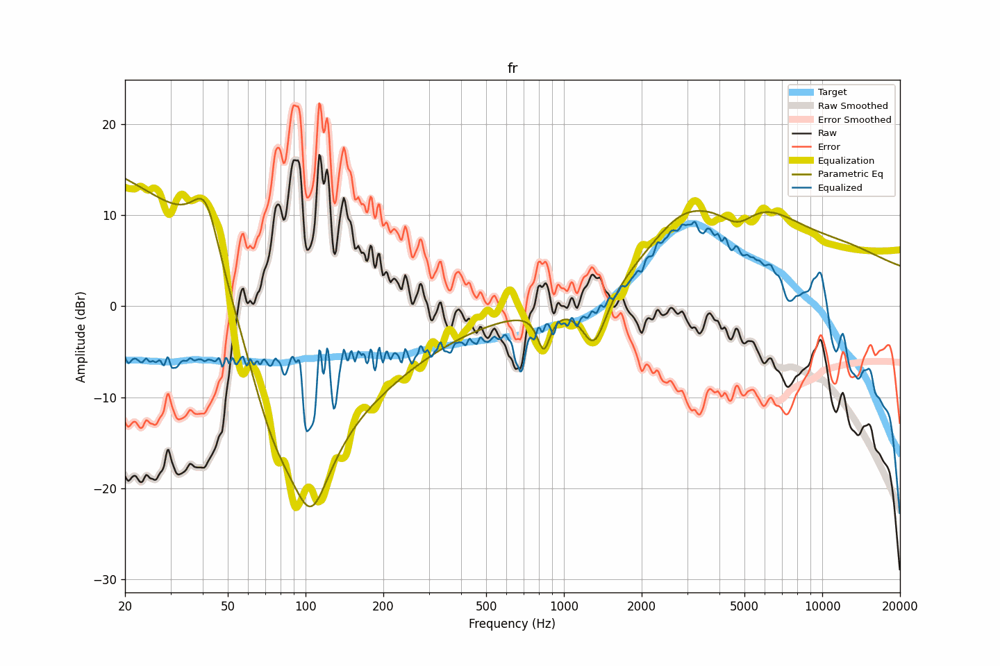

# fr
See [usage instructions](https://github.com/jaakkopasanen/AutoEq#usage) for more options and info.

### Parametric EQs
You can use filters 1-5 or 1-10. Apply preamp of -14.1 dB or -14.1 dB, respectively.

|   # | Type      |   Fc (Hz) |    Q |   Gain (dB) |
|-----|-----------|-----------|------|-------------|
|   1 | LowShelf  |       105 | 0.7  |        19   |
|   2 | Peaking   |        41 | 2.57 |         7.4 |
|   3 | Peaking   |        74 | 0.65 |       -20   |
|   4 | Peaking   |       105 | 1.24 |       -16.6 |
|   5 | Peaking   |      5237 | 0.54 |        11.1 |
|   6 | Peaking   |       836 | 5.87 |        -4.2 |
|   7 | Peaking   |      1310 | 2.88 |        -6.2 |
|   8 | Peaking   |      2814 | 1.14 |         3.8 |
|   9 | Peaking   |      4723 | 1.98 |        -3.1 |
|  10 | HighShelf |     10000 | 0.7  |         4   |

### Graphs

